# python-正则笔记

## 0x00 命名分组

### 命名分组捕获

``` python
import re
name = r'(?P<year>\d{4})-(?P<month>\d{2})-(?P<day>\d{2})'
r = re.search(name, "2018-09-12")
print r.group('year')
print r.group('month')
print r.group('day')
print r.group(1)
print r.group(2)
print r.group(3)
```

从上看出仍然可以用数字编号来引用分组。

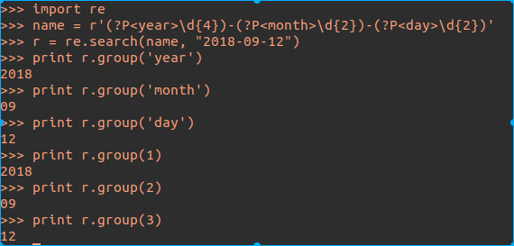

值得注意的是，需要反向引用时必须用`（？P=name）`,在正则表达式中进行替换需要写做`\g<name>`

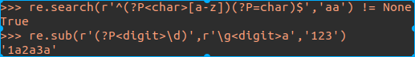

### 非捕获分组

非捕获分组不会保存匹配文本，能提高正则提高效率。

用法：`（？：...）`

示例：

``` python
print re.search(r'(\d{4})-(\d{2})-(\d{2})','2018-12-22').group(1)
print re.search(r'(?:\d{4})-(\d{2})-(\d{2})','2018-12-22').group(1)
```

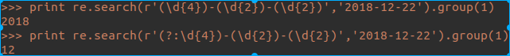


## 0x01 断言

断言用来判断某个位置的文本是否符合要求。

常见断言: 单词边界、行起始/结束位置、环视

### 单词边界

 `\b`是为了区分单词还是字符串而使用的

| 字符串 | \brow\b | \brow | row\b |
| :--: | :--: | :--: | :-: |
| tomorrow |  |      |√|
| brown |      |      ||
| row | √ | √ |√|
| rowby | | √ ||
| 表达式说明 | 只能是单词 | \b右侧是单词，左侧不能有字符 |\b左侧是单词，右侧不能有字符|


### 行起始/结束位置

#### 行终止符

|    平台    | 行终止符 |
| :--------: | :------: |
| UNIX/Linux |    \n    |
|  Windows   |   \r\n   |

利用多行模式匹配多行字符串：在正则前加上`(?m)`

```python
#提取每行的第一个单词
import re
str = 'first line\nsecond line\r\n\rlast line'
print re.findall(r'(?m)^\w+',str)
```


其中第三行因`\r`没有匹配上。

```python
#提取整段文本的第一个单词
import re
str = 'first line\nsecond line\r\nlast line'
print re.findall(r'(?m)\A\w+',str)
```

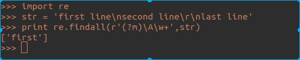

### 锚点$

#### 特性

`$`会判断行终止符是否存在，智能匹配行结束位置前的字符串

```python
#提取整段文本的最后一个单词
import re
str = 'Some sample test'
print re.findall(r'\w+$',str)
str = 'Some sample test\n'
print re.findall(r'\w+$',str)
```

结果是一样的。

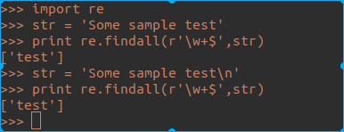


```python
#利用多行模式匹配每行最后一个单词
import re
str = 'first line1\nsecond line2\r\nlast line3'
print re.findall(r'(?m)\w+$',str)
```

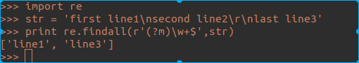

####  利用\A和\Z完成更准确的数据验证

由于`$`还能匹配行终止符,Apache HTTPD 换行解析漏洞（CVE-2017-15715）就是由于这个原因产生。有时就需要更准确的匹配。

```python
re.search(r'^\d{6}$','123456') !=None
re.search(r'^\d{6}$','123456\n') !=None
#python不支持\z,python的\Z等价于其他语言的\z
re.search(r'\A\d{6}\Z','123456') !=None
re.search(r'\A\d{6}\Z','123456\n') !=None
```

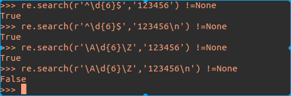

### 替换时不会被替代

看下面用例,可以处理文本格式。

#### 替换

```python
import re
str = "line1\nline2\nline3"
print str
print re.sub(r'(?m)$','</p>',re.sub(r'(?m)^','<p>',str))
```

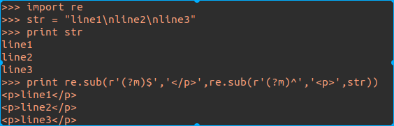

#### 处理行首尾空白字符

```python
import re
str = "  begin\n between\t\n\nend "
print str
print re.sub(r'(?m)^\s+','',re.sub(r'(?m)\s+$','',str))
```

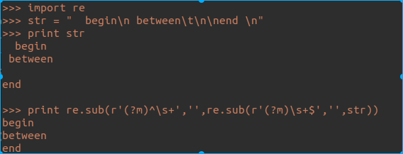

### 环视

这部分概念有些多，但是结合实际例子还是很好理解的。

#### 环视分类

|     名字     |    记法    | 判断方向 |
| :----------: | :--------: | :------: |
| 肯定顺序环视 | （?=...）  |   向右   |
| 否定顺序环视 | （?!...）  |   向右   |
| 肯定逆序环视 | （?<=...） |   向左   |
| 否定逆序环视 | （?<!...） |   向左   |

总结一下：

1. 向右看就叫顺序，向左就叫逆序，这和现代人的阅读方向是一致的。

2. 肯定是要匹配的字符串，否定是排除的字符串

3. 肯定：`=`，否定：`！`，顺序：`没有<` ，逆序：`<`


#### 例1

将，添加到右侧字符串是3的倍数处。即12345，变成12,345


   ```python
import re
print re.sub(r'(?=\d{3})',',','12345')
   ```

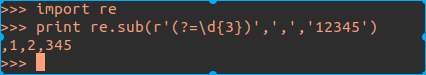

产生这个原因是环视的特性：原地执行。可以把`12345`看成` 01020304050`，（0表示位置，不是表示数字。）现在我处在第一个0的位置，右边存在3个数字，满足正则，因此将第一处`0`替换为`，`，在下一个0位置同理。

改进

```python
 	import re
 	#利用+(?!\d)匹配到字符串尾
 	print re.sub(r'(?=(\d{3})+(?!\d))',',','123456789')
 	#改进3的倍数时首部插入，
    print re.sub(r'(?<=\d)(?=(\d{3})+(?!\d))',',','123456789')
```

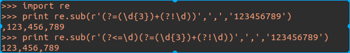

#### 例2

去除中英文混排

```python
import re
str = '中 英文混排, some English word, 有多余的空 白字符'
print re.sub(r'(?<![a-zA-Z])\s+(?![a-zA-Z])','',str)
```

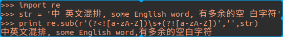


#### 环视结构不影响引用分组

```python
import re
print re.search(r'(?!=ab)(cd)','abcd').group(0)
print re.search(r'(?!=ab)(cd)','abcd').group(1)
```


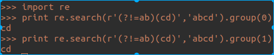

环视的用法还很多，这里不能一一列举了。

## 匹配模式

### 模式修饰符

python中用`（？i）`来实现不去区分大小写模式

```python
import re
re.search(r'(?i)the','The') != None
re.search(r'(?i)the','the') != None
re.search(r'(?i)the','THE') != None
```

### 预订义常量

python：re.I （预定义常量在不同语言中写法不同）

```python
import re
re.search(r'the','The',re.I) != None
re.search(r'the','the',re.I) != None
re.search(r'the','THE',re.I) != None
```

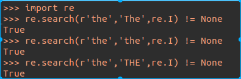

### 常见匹配模式表格（python）

|    模式    | 模式修饰符用法 |     预定义常量     |                          备注                           |
| :--------: | :------------: | :----------------: | :-----------------------------------------------------: |
|  单行模式  |      (?s)      |  re.S和re.DOTALL   | s（Single line) ，单行模式解决的是.不能代表换行符的问题 |
|  多行模式  |     （?m）     | re.M和re.MULTILINE |              使^和$能匹配每行的行首和行尾               |
| 不分大小写 |     （?i）     |        re.I        |                                                         |
|  注释模式  |     （?x）     |  re.X和re.VERBOSE  |                   comment是注释的内容                   |
多行模式:

```python
import re
mstr = '1 line\nNot digit\n2 line'
for line in re.findall(r'(?m)^\d.*',mstr):
    print line
```

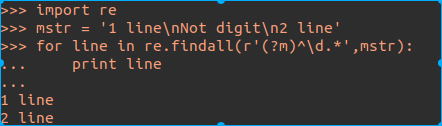

### 作用范围

|   正则    |    匹配文本     |
| :-------: | :-------------: |
|  t(?i)ht  | tHE the thE tHe |
|  th(?i)e  |     thE the     |
| t((?i)h)e |     tHe the     |
| t(?i:h)e  |     tHe the     |

总结：

1. 放在开头全局起作用
2. 放在中间对后部分起作用
3. 在括号内仅对括号范围起作用


